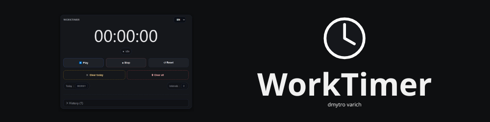
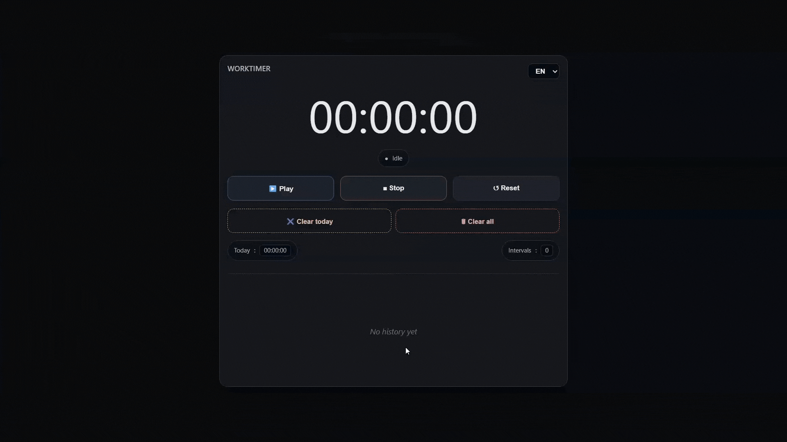

# ⏲️ WorkTimer



[WorkTimer](https://dmytro-varich.github.io/WorkTimer/) is a web time tracker that tracks work sessions with `play`/`pause`/`stop`/`reset`, automatically logs intervals, keeps a persistent history, supports a multilingual and accessible UI, and generates one‑click copyable summaries 💼. 

## ✨ Features

* **Timer Controls** – Start, Pause, Stop, and Restart with automatic interval logging.
* **Today’s Summary** – Easily copy your work intervals.
* **History Management** – Full history saved with options to Clear Today or Clear All.
* **Responsive & User-Friendly** – Works smoothly on desktop and mobile, with dark theme support.
* **Multilingual Interface** – Switch seamlessly between English (EN) and Ukrainian (UA).

## 🎥 Demo Video
<p align="center">
  
</p>


## 🛠️ Development
<p align="center">
  
  
  
  
  
</p>

### 🧰 Tech Stack

| Category | Details |
|-----------|----------|
| **Languages** | HTML5 · CSS3 · JavaScript *(ES2015+ with ES Modules)* |
| **UI** | CSS Grid · Flexbox · CSS Variables · Responsive Design · Dark Theme |
| **Architecture** | Modular Vanilla JS *(state · storage · UI · i18n)* — no frameworks |
| **Browser APIs** | DOM · localStorage · Clipboard API · Intl.DateTimeFormat · requestAnimationFrame |
| **i18n & a11y** | Built-in translations *(EN/UA)* · ARIA / focus management |


### 🗂️ Project Structure 
```md
WorkTimer/
│── index.html                     # App shell (mount point, favicon, CSS includes)
│── README.md                      # Project documentation
│── .github/
│   └── assets/
│       └── worktimer_intro.png    # Images used in README/issues
│── assets/
│   └── icon.svg                   # Favicon (referenced by index.html)
│── src/
│   ├── main.js                    # App bootstrap, event wiring, init
│   ├── i18n/
│   │   └── lang.js                # Translations, language switching (i18n)
│   ├── state/
│   │   └── session.js             # Timer/session state, reducers, calculations
│   ├── storage/
│   │   └── local.js               # localStorage persistence layer
│   ├── ui/
│   │   ├── render.js              # UI rendering, history/intervals, indicators
│   │   └── modal.js               # Summary modal, copy-to-clipboard, a11y
│   ├── utils/
│   │   └── time.js                # Time/format helpers
│   └── styles/
│       ├── base.css               # Base styles, resets, variables
│       └── app.css                # App layout, components, responsive rules
```

## 🚀 Quick Start
1. Clone this project to your computer using the following command:
   ```bash
   git clone https://github.com/dmytro-varich/WorkTimer.git
   ```
2. Navigate to the project’s root directory using the command:  
   ```bash
   cd WorkTimer
   ```
3. If you’re working in [VS Code](https://code.visualstudio.com/download), install the [Live Server](https://marketplace.visualstudio.com/items?itemName=ritwickdey.LiveServer) extension.
4. Open the index.html file, right-click on it, and select **Open with Live Server**. After that, the project’s web page will open — and whenever you make changes to the code, the page will automatically refresh.
5. Now you can start working on the project — edit the code, experiment with features, and customize it however you like.

## 📘 Usage

1. **Starting and Controlling the Timer**

   * Click **Play** to start the stopwatch.
   * To pause, click **Pause**.
   * When you finish working and want to see the results, click **Stop**.
   * After clicking **Stop**, a modal window with your **Today’s Summary** will appear, showing all your work intervals. You can copy them directly from this window.

2. **Viewing History**

   * All your results are automatically saved in the history.
   * You can open the history at the bottom from the **History** dropdown.
   * Clicking any entry opens a modal window with the details of the selected day, where you can copy the data again.

3. **Clearing Data**

   * **Clear Today** — deletes only the records for the current day.
   * **Clear All** — deletes the entire history.

4. **Additional Features**

   * **Reset** — resets the timer and starts over.
   * **Interface Language** — switch between EN/UA in the top-right corner.
   * Next to the timer, the total **work time** for today and the number of **intervals** recorded during sessions are displayed.

5. **Usage Tips**

   * The timer is fully **responsive** and supports **dark mode**, making it convenient to use on both desktop and mobile devices.
   * The **Today’s Summary** modal allows you to easily **copy and save data** for tracking your work time.

## 🧑🏻 Author 
This web-app was created by Dmytro Varich and includes a built-in time-tracking feature to record how long he works (useful for calculating payment). You are, of course, free to use the application however you wish. You can learn more about his projects on his personal [Telegram channel](https://t.me/varich_channel), as well as connect with him via LinkedIn ([dmytro-varich](https://www.linkedin.com/in/dmytro-varich/)) and email (varich.it@gmail.com).

## 📌 More Info
Essentially, this entire project was built with the help of artificial intelligence. I acted as a curator — guiding the process, setting tasks, and fixing issues.
For AI tools, I used the **GPT-5** model in [ChatGPT](https://chatgpt.com/), and **Claude 4.5** as my assistant in [VS Code](https://code.visualstudio.com/download).
